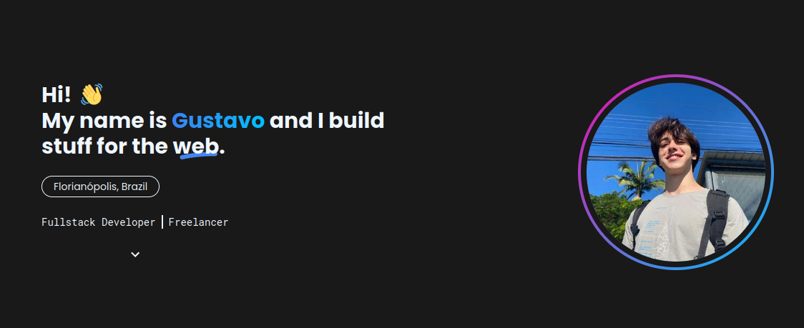

<h1 align="center">Portfolio DEV</h1>

Meu portfolio de desenvolvedor web, para aqueles que querem conhecer mais sobre mim.

  <a href="#-tecnologias">Tecnologias</a>&nbsp;&nbsp;&nbsp;|&nbsp;&nbsp;&nbsp;
  <a href="#-projeto">Projeto</a>&nbsp;&nbsp;&nbsp;|&nbsp;&nbsp;&nbsp;
  <a href="#-layout">Layout</a>&nbsp;&nbsp;&nbsp;|&nbsp;&nbsp;&nbsp;
  <a href="#memo-licença">Licença</a>

  

  

## 🚀 Tecnologias

Esse projeto foi desenvolvido com as seguintes tecnologias:

- NextJS v14
- TailwindCSS
- Typescript
- Git e Github
- Vercel

## 💻 Projeto

Este projeto foi feito para servir de portfolio e/ou landing page para me apresentar.

- [x] Finalizar Home page
- [x] Finalizar About page
- [ ] Finalizar Contact page
- [ ] Arrumar links
- [ ] Design responsivo
- [ ] Dark mode / light mode
- [ ] Animações

- [Acesse o projeto finalizado, online (projeto não hospedado ainda)](#)

## 🔖 Layout

Não há um arquivo de layout para o projeto.

## :memo: Licença

Esse projeto está sob a licença MIT.

---

Feito por Gustavo Zonta :wave:

